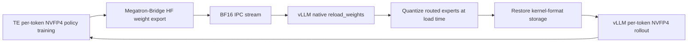

# End-to-End NVFP4 Training with Per-Token vLLM Rollout

## Overview

NeMo RL supports end-to-end W4A4 reinforcement learning for Qwen3 MoE models
on NVIDIA Blackwell GPUs. During policy training, Transformer Engine (TE)
applies NVFP4 to routed-expert MLP computation with per-token activation
scaling. During rollout, vLLM uses NVFP4 fused-MoE kernels with the same
per-token activation granularity.

The model keeps BF16 master parameters and FP32 optimizer states. Attention,
routers, shared experts, embeddings, normalization layers, and selected
boundary layers remain in BF16. The policy backward pass currently uses TE's
dequantized path.

After every policy update, NeMo RL exports the updated BF16 weights to each
colocated vLLM engine. The rollout workers quantize routed-expert weights while
vLLM's native `reload_weights` API consumes the checkpoint-format stream before
the next rollout. This keeps the training and rollout paths on the same NVFP4
weight and activation-scaling contract without making training aware of the
rollout representation.

## Performance and GPU Memory

The following comparison uses Qwen3-30B-A3B-Base with DAPO on 8 nodes with
4 GB200 GPUs per node, a global batch size of 512, and a 20K response limit.
Training uses TP=2, EP=8, and PP=1; each vLLM engine uses TP=1.
Each value is the median over the 502 logged steps shared by both runs between
steps 200 and 800. These are representative runs rather than a controlled
precision-only A/B; their configurations differ beyond numerical precision.

| Metric | BF16 | NVFP4 W4A4 | Change |
|---|---:|---:|---:|
| Rollout generation throughput | 457.9 tokens/s/GPU | 799.4 tokens/s/GPU | 1.75x |
| Generation time | 319.2 s | 144.7 s | 2.21x faster |
| Observed step time | 390.9 s | 224.8 s | 42.5% lower |
| Token-normalized end-to-end throughput | 376.1 tokens/s/GPU | 506.2 tokens/s/GPU | 1.35x |
| Weight transfer and update* | 1.76 s | 17.93 s | 16.17 s higher |

The NVFP4 run generated shorter responses in this interval, so observed step
time alone overstates the speedup: its median response length was approximately
6,219 tokens, compared with 7,730 tokens for BF16. Generation throughput and
token-normalized end-to-end throughput control for this difference. Policy
training time is currently similar because the backward path remains
dequantized; the main gain comes from W4A4 rollout.

NVFP4 stores each quantized weight using an E2M1 value, one E4M3 scale per
16-value block, and one FP32 global scale per tensor. Excluding the small
per-tensor scale overhead, this is approximately 4.5 bits per quantized weight,
compared with 16 bits for BF16.

Both runs set `gpu_memory_utilization=0.5`. The vLLM logs report the following
rollout memory values for each TP=1 engine:

| Rollout memory | BF16 | NVFP4 W4A4 | Change |
|---|---:|---:|---:|
| Model weights | 56.88 GiB | 18.07 GiB | 68.2% lower |
| Available KV cache | 30.37 GiB | 79.70 GiB | 2.62x |
| KV cache token capacity | 331,744 | 870,560 | 2.62x |

These values describe the vLLM rollout model and KV cache, not the peak memory
of the complete colocated RL process. Process-wide GPU samples also include TE
training workspaces, quantization buffers, and allocator caching, and did not
show a lower end-to-end peak in this comparison. The current result therefore
demonstrates lower rollout weight memory and greater KV-cache headroom, rather
than lower peak memory for the full training process.

\* The original 17.93 s value was measured with routed-expert quantization on
the Megatron training worker. After quantization moved to the vLLM worker,
representative refits measured 17.6–18.7 s, consistent with the original row.

Profiling the vLLM-side path showed that native weight loading, rather than IPC
transfer or NVFP4 arithmetic, dominates refit time:

| Refit phase | Representative time | Share |
|---|---:|---:|
| vLLM load and layer processing | 13.13 s | 75% |
| NVFP4 quantization | 3.80 s | 22% |
| IPC wait and other work | 0.66 s | 4% |
| Finalization after all layers load | approximately 0 s | approximately 0% |

The load phase is Python-call-bound. Qwen3-30B-A3B emits 64,512 per-expert
checkpoint names per refit across 42 quantized layers and 128 experts, and each
name passes through vLLM's mapping, loader, and layerwise-reload bookkeeping.

A research-only prototype coalesced those outputs into eight full fused-expert
parameters per layer. In paired 90-step runs, the production per-expert path
measured 18.42 s mean and median refit time; the prototype measured 6.31 s mean
and 6.38 s median, a 2.92x improvement. Both runs completed successfully. The
prototype is not part of this feature because complete fused-parameter loading
depends on vLLM's internal expert layout and should be implemented upstream.

Refit remains a visible part of the step and an optimization target.
Training-quality curves will be added after the ongoing long-run stability
validation is complete.

## Quick Start

Start with the complete Qwen3-30B-A3B example:

```bash
uv run examples/run_grpo.py \
  --config examples/configs/recipes/llm/grpo-qwen3-30ba3b-4n4g-megatron-te-nvfp4-pertoken-quick.yaml
```

The feature-specific policy configuration is:

```yaml
policy:
  generation:
    colocated:
      enabled: true
    nvfp4_pertoken_rollout:
      enabled: true
      additional_ignore:
        - "*.layers.0.mlp.experts*"
        - "*.layers.1.mlp.experts*"
        - "*.layers.44.mlp.experts*"
        - "*.layers.45.mlp.experts*"
        - "*.layers.46.mlp.experts*"
        - "*.layers.47.mlp.experts*"
    vllm_cfg:
      precision: bfloat16
      kv_cache_dtype: auto
      expert_parallel_size: 1

  megatron_cfg:
    moe_router_dtype: fp32
    fp4_cfg:
      enabled: true
      fp4: e2m1
      fp4_recipe: nvfp4
      fp4_param: false
    first_last_layers_bf16: true
    num_layers_at_start_in_bf16: 2
    num_layers_at_end_in_bf16: 4
    te_precision_config_file: examples/configs/te_precision/attn_bf16_mlp_nvfp4.yaml
    env_vars:
      NVTE_NVFP4_ROW_SCALED_ACTIVATION: "1"
      NVTE_NVFP4_DISABLE_RHT: "1"
      NVTE_NVFP4_DISABLE_2D_QUANTIZATION: "1"
      NVTE_NVFP4_DISABLE_STOCHASTIC_ROUNDING: "1"
      NVTE_BACKWARD_OVERRIDE: dequantized
```

`additional_ignore` keeps complete routed-expert layers in BF16 during rollout.
It must cover the same boundary layers selected by
`first_last_layers_bf16`, `num_layers_at_start_in_bf16`, and
`num_layers_at_end_in_bf16`. Only complete expert-layer patterns in the form
`*.layers.<index>.mlp.experts*` are accepted.

## How It Works



### Per-token NVFP4 policy training

`policy.megatron_cfg.fp4_cfg` enables TE NVFP4, while
`te_precision_config_file` selects which modules use it. The provided precision
recipe applies NVFP4 to MLP linears and keeps attention linears in BF16.

`fp4_param=false` keeps persistent model parameters in BF16. NVFP4 is used for
the selected forward computations, while the optimizer continues to update the
BF16 model through FP32 master parameters. FP8 and FP4 cannot be enabled
together.

During policy training, per-token activation scaling gives each token its own
activation range. This reduces the effect of outlier tokens and matches the
activation granularity used by the rollout kernel.

### Weight refit

Megatron-Bridge exports the updated policy weights with Hugging Face parameter
names and reconstructs tensors across the training TP, PP, and EP topology,
sending plain BF16 — identical to a BF16-only run. Training stays entirely
unaware of NVFP4.

Each vLLM engine receives the BF16 stream over CUDA IPC. NeMo RL converts each
transport batch into owned checkpoint-format tensors and supplies one lazy
iterator to vLLM's native `reload_weights` API. Routed-expert projections are
quantized at load time, mirroring the fp8/mxfp8 "real quant" rollout path:
gate and up projections are quantized together under one shared per-expert
global scale (vLLM's fused-MoE loader keeps only one gate/up scale per expert),
and down projections are quantized independently. Ignored BF16 expert layers
(`additional_ignore`) pass through unchanged.

The IPC allocation is acknowledged only after quantization and passthrough
copies no longer depend on it. The final COMPLETE message is acknowledged only
after `reload_weights` has consumed the entire stream, performed layerwise
post-processing, and completed the final device fence. If preparation or load
fails, the remaining IPC messages are drained and acknowledged so the sender
cannot deadlock, and the rollout worker raises instead of serving stale
weights.

### Per-token vLLM rollout

NeMo RL configures vLLM with the `nvfp4_pertoken` quantization mode. During
refit, vLLM loads the packed expert weights, prepares them for the FlashInfer
fused-MoE runtime, and rebuilds the affected kernels. Rollout activations are
quantized dynamically for each token; no static activation calibration is
required.

The native reload path restores checkpoint-shaped parameters layer by layer,
loads and processes them, then copies the resulting kernel-format tensors back
into the storage used by CUDA graphs. A failed or incomplete refit stops the
rollout instead of continuing with stale weights.

## Supported Configuration

| Setting | Current support |
|---|---|
| Hardware | NVIDIA Blackwell; validated on GB200 |
| Model | `Qwen3MoeForCausalLM` with an MoE block in every decoder layer |
| Quantized modules | Routed-expert MLP projections |
| Policy parameters | BF16 with `fp4_param=false` |
| Rollout | Colocated vLLM, synchronous or asynchronous |
| vLLM tensor parallelism | Supported; TP=1 and TP=2 are validated |
| vLLM pipeline parallelism | Supported; PP=1 and PP=2 are validated; PP>1 requires the asynchronous engine |
| vLLM expert parallelism | EP=1 |
| KV cache | `auto` |
| Refit transport | Default colocated CUDA IPC/ZMQ path (`refit_transport: null`) |

Other generation quantization settings, including `generation.quant_cfg` and
`generation.real_quant`, must be unset when this mode is enabled. Incompatible
settings are reported during setup.

Dense MLP layers, hybrid dense/MoE layouts, and vLLM expert parallelism are not
yet supported by this path.

## Roadmap

- Reduce refit latency, including an upstream vLLM full fused-parameter loader
  and quantization before the expert-parallel gather.
- Add native NVFP4 backward computation.
- Complete longer stability and model-quality studies and publish the training
  curves.
